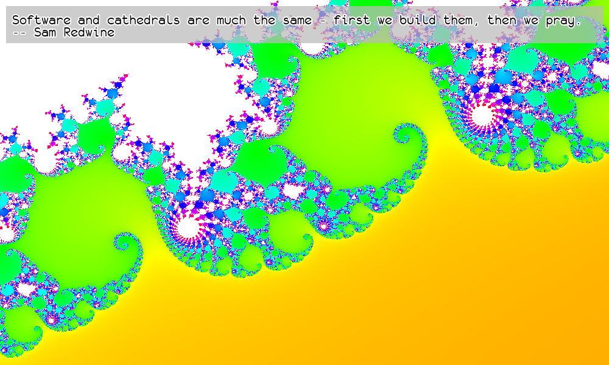

# Mandelquote

[Mandelbrot](https://en.wikipedia.org/wiki/Mandelbrot_set) image generator quote display for a Raspberry Pi with a [Pimoroni Inky Impression display](https://shop.pimoroni.com/products/inky-impression-5-7).
It will probably work with other Inky displays.
Can be run without a Raspberry Pi or Inky display, in which case it will generate a series of PNGs.

## Running

First install the required dependencies:

```
pip3 install -r requirements.txt
```

To use an Inky display with a Raspberry Pi, install the [Inky library](https://github.com/pimoroni/inky):

```
pip3 install inky[rpi]
```

Then to run manually, simply:

```
./mandelbrot.py
```

Parameters can be tweaked inside the script and quotes can be changed in `quotes.txt`.

## Example Output




